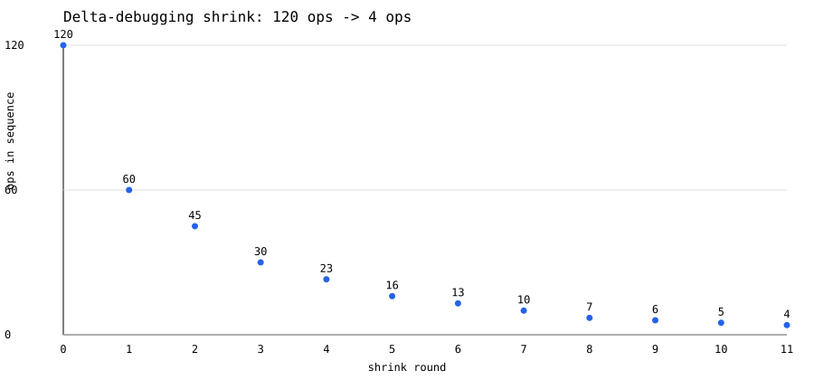

# The bug I had to build a bisector to find

Strata is a small log-structured key-value store I built from scratch in Go —
WAL, memtables, SSTables, leveled compaction, the usual LSM-tree shape. This
post is about one specific invariant in it, why it's the kind of thing that's
almost impossible to catch by reading code or running normal tests, and what
it took to actually prove it holds.

## Deletes don't delete anything

SSTables are immutable once written. So a `DELETE` in an LSM tree can't erase
the old value — it writes a **tombstone**, a marker that says "this key is
gone" that outranks any older value for the same key still sitting in a lower
level of the tree.

Eventually the tombstone has to be thrown away, or you leak disk forever.
That happens during compaction. And it's exactly one rule that decides when
it's safe:

> A tombstone may only be dropped when compacting into the bottom-most level
> that could contain that key, and no open snapshot still needs it.

Drop it one level too early, while an older version of the key still lives
further down the tree, and the delete just disappears. The old value comes
back. A key the caller deleted an hour ago starts answering `GET` again,
non-deterministically, only after the tree has compacted enough times to
surface it. There's no crash, no error, no log line — just a wrong answer,
arbitrarily far downstream of the bug that caused it.

That failure mode is close to un-debuggable by inspection. You're not going
to find it by reading the compaction picker carefully enough. You need
something that can *notice* the wrong answer and, more importantly, hand you
back the minimum number of operations that produce it.

## Proving the harness would catch it

Rather than wait to trip over this bug for real, I built a model-based test
harness and then deliberately broke the engine in exactly this way, to prove
the harness would catch the real failure if it ever happened.

The harness (`test/model/`) runs a plain in-memory reference map and the real
`engine.LSM` side by side against the same randomly generated sequence of
operations — `PUT`, `DELETE`, `COMPACT`, `SCAN` — and fails the instant they
disagree.

The injected bug lives in `resurrectingSystem`, a thin wrapper around the
real engine:

```go
func (r *resurrectingSystem) Compact() error {
    if err := r.lsmSystem.Compact(); err != nil {
        return err
    }
    for k := range r.deleted {
        v, ok := r.last[k]
        if !ok {
            continue // never had a value to resurrect
        }
        if err := r.lsmSystem.Put([]byte(k), []byte(v)); err != nil {
            return err
        }
        delete(r.deleted, k)
    }
    return nil
}
```

After every compaction, it silently re-inserts the last known value for every
key that was deleted — reproducing, from the outside, exactly what a
compactor that dropped a tombstone too early would look like. The harness
can't tell this apart from the real bug, which is the point.

## From "something's wrong" to "here's the bug"

A randomly generated 120-operation sequence against this wrapper fails
immediately. But "a 120-operation sequence diverged" is not a diagnosis —
it's a fact. Nobody is going to read 120 interleaved puts, deletes, compactions,
and scans and spot the pattern.

So the harness shrinks it. Delta debugging — repeatedly cut a chunk out of
the sequence, keep the cut if it still fails, halve the chunk size once a
full pass finds nothing — converges on a local minimum in O(n log n)
attempts instead of the O(2ⁿ) an exhaustive search would need.

Here's what that actually looked like on one real run, logging the sequence
length after every successful cut:

```
120 → 60 → 45 → 30 → 23 → 16 → 13 → 10 → 7 → 6 → 5 → 4
```



Twelve rounds of shrinking, twelve halvings-and-retries, and the sequence
that started at 120 operations ends at four:

```
PUT "key-0005" "v555945"
DEL "key-0005"
COMPACT
SCAN count=8
```

That's the bug. Put a key, delete it, compact, and look — the deleted key
comes back. The shrinker doesn't just report a smaller number; the test
asserts the minimal sequence still *contains* the delete and the compaction
that triggers the resurrection, so it isn't reporting some unrelated failure
that happened to also be small.

## Why this matters more than it looks

The value here isn't the property-based testing — random input generation
against a reference model is a known technique. The value is specifically in
the shrinker, because it's the difference between two very different
debugging sessions:

- *"A 10,000,000-operation soak run diverged somewhere."*
- *"`PUT`, `DELETE`, `COMPACT`, `SCAN` reproduces it every time."*

The first one is a multi-day bisection exercise against a system with
concurrent compaction, background flushes, and non-deterministic timing. The
second is something you can step through in a debugger in five minutes.

And the harness earns its keep on the honest case too, not just the
artificial one: the same framework ran 10,000,000 operations against the
real engine with **zero divergence**, in 25m14s, sustaining roughly 6,600
ops/s once the tree reached steady depth. That number matters precisely
*because* the harness has already proven, on the injected bug, that it knows
how to catch this exact class of failure and hand back a four-line repro
instead of a haystack.

---

*Strata is on GitHub at [github.com/AbishekRaj2007/Strata](https://github.com/AbishekRaj2007/Strata).*
